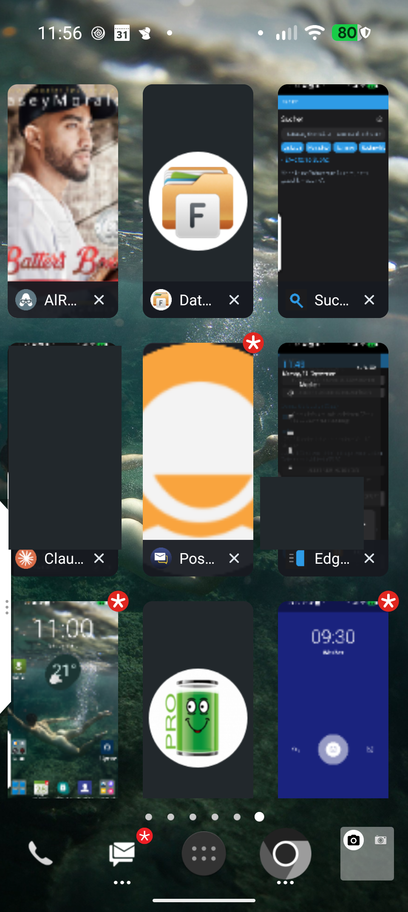
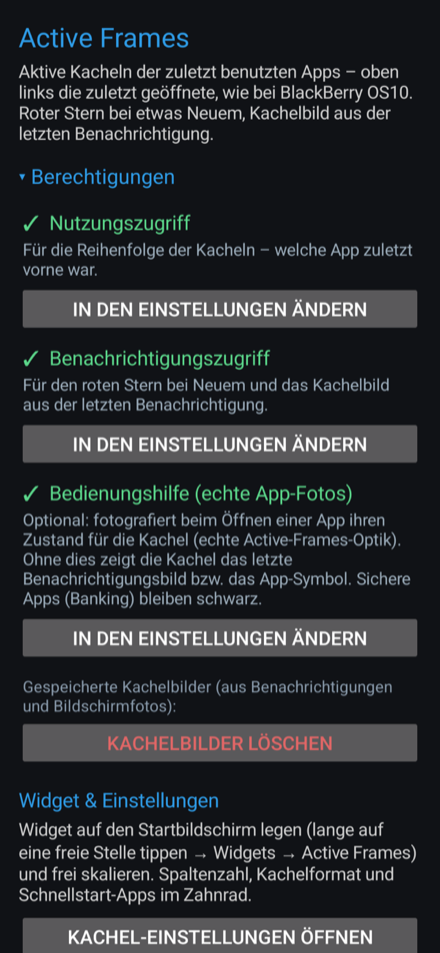
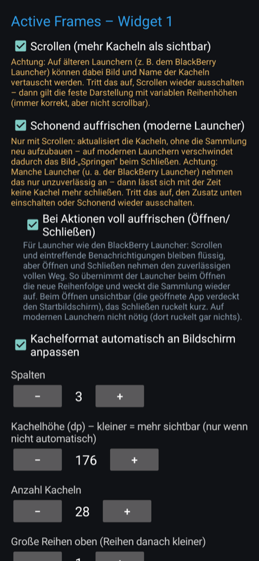

# Active Frames

A from-scratch Android recreation of BlackBerry OS10's "Active Frames" — a
resizable home-screen widget of your most-recently-used apps as a scrollable
grid of tiles, each showing the content of the app's latest notification
(photo, album art, large icon) with a red star when there's something new.

*Eine von Grund auf neu geschriebene Nachbildung von BlackBerry OS10s „Active
Frames" — ein größenveränderbares Startbildschirm-Widget mit den zuletzt
benutzten Apps als scrollbares Kachelraster; jede Kachel zeigt den Inhalt der
letzten Benachrichtigung, roter Stern bei Neuem.*

## Requirements / Voraussetzungen

- **Android 10 or newer** (`minSdkVersion` 29). Built against / target
  `targetSdkVersion` 34 (Android 14).
- *Läuft ab **Android 10** aufwärts (Mindest-SDK 29), erstellt/geprüft gegen
  Ziel-SDK 34 (Android 14). Kein BlackBerry-Gerät nötig.*

## Screenshots

<table>
<tr>
<td><br>Widget 1 (Startbildschirm)</td>
<td><br>Einrichtung</td>
<td><br>Einstellungen</td>
</tr>
</table>

<sub>Screenshots aus dem echten Betrieb – persönliche Inhalte in einzelnen Kacheln wurden geschwärzt.</sub>

## Features

- **Scrollable tile grid widget**, freely resizable. Adjustable columns, tile
  height (i.e. aspect ratio — rectangular like BlackBerry's screens, not only
  square), tile count, variable row heights (larger rows on top), and an
  optional scrolling mode (see note below).
- **MRU order like BlackBerry**: top-left is the most recently used app, then
  the one before, and so on (via `UsageStatsManager`).
- **Living tiles**: each tile shows the latest notification's image — chat
  photo, album art, large icon — falling back to the app **logo** shown tile-
  sized (centred, undistorted) when there is no image
  (`NotificationListenerService`).
- **Red star** on a tile when that app has something new; cleared on launch.
- **Optional real app photos**: with the accessibility service enabled, a tile
  can show a real screenshot of the app's last state (true Active-Frames look).
  Apps that block screenshots (banking, BBMe) show their logo instead of a
  black tile. Images stay on the device only.
- **Second, native widget for [EdgeTab](https://github.com/8818freak/EdgeTab)
  ("Widget 2")**: an "Active Frames" card inside EdgeTab's edge panel that reads
  its data (order, stars, images) from Active Frames over a private, EdgeTab-
  only content provider — so EdgeTab needs no extra permissions, and because
  EdgeTab draws the tiles itself, that card scrolls reliably even on older
  launchers.
- **Backup & restore** of all settings to a file (via the system file dialog).
- No ads, no analytics, no billing, no internet permission.

## Scrolling note / Hinweis zum Scrollen

The home-screen widget's optional scrolling mode uses an Android RemoteViews
collection. On most launchers it works; on some older ones (e.g. the BlackBerry
Launcher) collection tiles could previously swap image/name. That is fixed by
sending small per-tile bitmaps (the same approach BlackBerry's own Hub widget
uses) instead of `content://` image URIs. If you still see glitches on an
unusual launcher, turn scrolling off — the fixed grid with variable row heights
is always correct — or use "Widget 2" inside EdgeTab, which scrolls natively.

## The honest limitation

True per-app screen snapshots (BlackBerry's actual live frames) are **not
available to a non-system app** on Android — only the system launcher, bound
to SystemUI over privileged interfaces, can read `TaskSnapshot`s, and no
launcher exposes them to other apps. The notification image is the closest
feasible substitute (and is what commercial equivalents use, too).

## Documentation / Dokumentation

- **English:** [User guide](docs/ActiveFrames-Guide.pdf) · [Flyer](docs/ActiveFrames-Flyer.pdf)
- **Deutsch:** [Anleitung](docs/ActiveFrames-Anleitung.pdf) · [Werbung](docs/ActiveFrames-Werbung.pdf)

## Building

No Gradle — built directly with the raw Android SDK command-line tools. You
need `platforms;android-34`, `build-tools;34.0.0`, `platform-tools`, a JDK
(11+), and your own signing keystore (none is included).

```sh
SDK=/path/to/android/sdk
BT="$SDK/build-tools/34.0.0"
AJAR="$SDK/platforms/android-34/android.jar"

rm -rf build && mkdir -p build/gen build/obj
"$BT/aapt2" compile --dir res -o build/res.zip
"$BT/aapt2" link -o build/base.apk -I "$AJAR" --manifest AndroidManifest.xml \
  --java build/gen -R build/res.zip -A assets --auto-add-overlay \
  --min-sdk-version 29 --target-sdk-version 34
javac --release 11 -d build/obj -cp "$AJAR" $(find src build/gen -name '*.java')
"$BT/d8" --min-api 29 --lib "$AJAR" --output build/ $(find build/obj -name '*.class')
cp build/base.apk build/unsigned.apk && (cd build && zip -qj unsigned.apk classes*.dex)
"$BT/zipalign" -f -p 4 build/unsigned.apk build/aligned.apk
"$BT/apksigner" sign --ks keystore.p12 --ks-pass pass:YOURPASS --ks-key-alias YOURALIAS \
  --out build/ActiveFrames.apk build/aligned.apk
```

## License

GNU General Public License v3.0 (or later) — see `LICENSE`.
